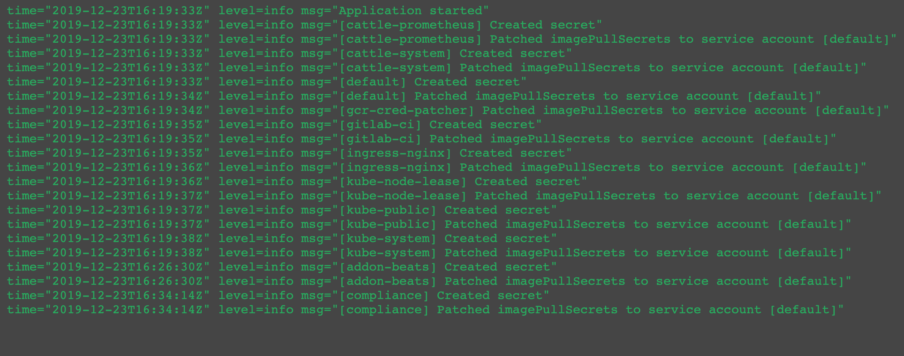

# imagepullsecret-patcher

[](https://travis-ci.org/titansoft-pte-ltd/imagepullsecret-patcher)
[](https://goreportcard.com/report/github.com/titansoft-pte-ltd/imagepullsecret-patcher)


A simple Kubernetes [client-go](https://github.com/kubernetes/client-go) application that creates and patches imagePullSecrets to service accounts in all Kubernetes namespaces to allow cluster-wide authenticated access to private container registry.



A blog post: https://medium.com/titansoft-engineering/kubernetes-cluster-wide-access-to-private-container-registry-with-imagepullsecret-patcher-b8b8fb79f7e5

## Installation and configuration

To install imagepullsecret-patcher, can refer to [deploy-example](deploy-example) as a quick-start. 

Below is a table of available configurations:

| Config name | ENV | Command flag | Default value | Description |
|-|-|-|-|-|
| force | CONFIG_FORCE | -force | true | overwrite secrets when not match |
| debug | CONFIG_DEBUG | -debug | false | show DEBUG logs |
| all service account | CONFIG_ALLSERVICEACCOUNT | -allserviceaccount | false | if false, patch just default service account; if true, list and patch all service accounts |
| dockerconfigjson | CONFIG_DOCKERCONFIGJSON | -dockerconfigjson | "" | json credential for authenicating container registry |
| secret name | CONFIG_SECRETNAME | -secretname | "image-pull-secret" | name of managed secrets |
| excluded namespaces | CONFIG_EXCLUDED_NAMESPACES | -excluded-namespaces | "" | comma-separated namespaces excluded from processing |
| default serviceaccount | CONFIG_DEFAULT_SERVICEACCOUNT | -default-serviceaccount | "default" | name of which serviceaccount to patch |

And here are the annotations available:

| Annotation | Object | Description |
|-|-|-|
| k8s.titansoft.com/imagepullsecret-patcher-exclude | namespace | If a namespace is set this annoation with "true", it will be excluded from processing by imagepullsecret-patcher. |

## Why

To deploy private images to Kubernetes, we need to provide the credential to the private docker registries in either
- Pod definition (https://kubernetes.io/docs/concepts/containers/images/#specifying-imagepullsecrets-on-a-pod)
- Default service account in a namespace (https://kubernetes.io/docs/tasks/configure-pod-container/configure-service-account/#add-imagepullsecrets-to-a-service-account)

With the second approach, a Kubernetes cluster admin configures the default service accounts in each namespace, and a Pod deployed by developers automatically inherits the image-pull-secret from the default service account in Pod's namespace. 

This is done manually by following command for each Kubernetes namespace.

```
kubectl create secret docker-registry image-pull-secret \
  -n <your-namespace> \
  --docker-server=<your-registry-server> \
  --docker-username=<your-name> \
  --docker-password=<your-pword> \
  --docker-email=<your-email>

kubectl patch serviceaccount default \
  -p "{\"imagePullSecrets\": [{\"name\": \"image-pull-secret\"}]}" \
  -n <your-namespace>
```

And it could be automated with a simple program like imagepullsecret-patcher.

## Contribute

Development Environment
- Go 1.13
