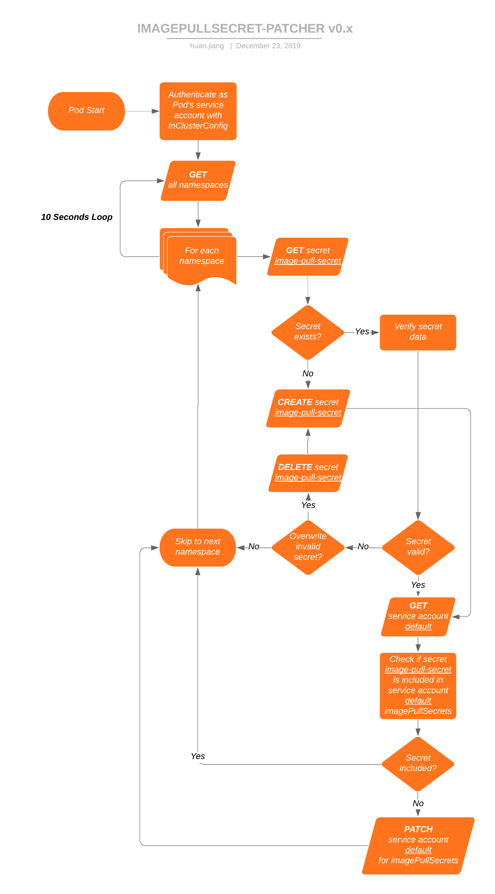

# imagepullsecret-patcher

Create and patch image pull secret to all namespaces in Kubernetes cluster.

## Installation and configuration

To install imagepullsecret-patcher, can refer to [deploy-example](deploy-example) as a quick-start. 

Below is a table of available configurations:

| Config name | ENV | Command flag | Default value | Description |
|-|-|-|-|-|
| force | CONFIG_FORCE | -force | true | overwrite secrets when not match |
| debug | CONFIG_DEBUG | -debug | false | show DEBUG logs |
| dockerconfigjson | CONFIG_DOCKERCONFIGJSON | -dockerconfigjson | "" | json credential for authenicating container registry |
| secret name | CONFIG_SECRETNAME | -secretname | "image-pull-secret" | name of managed secrets |

## Why

In order to access the private registries, we need to provide the credential in either
- Pod definition (https://kubernetes.io/docs/concepts/containers/images/#specifying-imagepullsecrets-on-a-pod)
- Default service account in a namespace (https://kubernetes.io/docs/tasks/configure-pod-container/configure-service-account/#add-imagepullsecrets-to-a-service-account)

With the second approach, Pods without a imagePullSecret in the spec will automatically inherit those from the default service account in its namespace. We don't want developers to specify that in every single Pod they create.

## How

The imagepullsecret-patcher does two things: create a secret called `image-pull-secret` in all namespaces, and patch the `default` service accounts to use those secrets as imagePullSecrets.

## Contribute

Development Environment
- Go 1.13